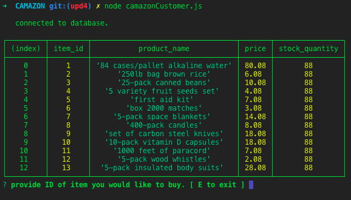
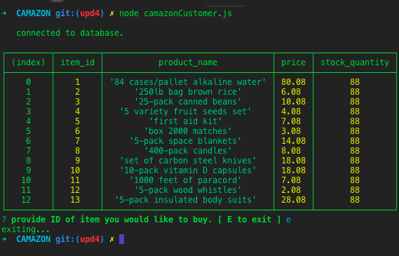
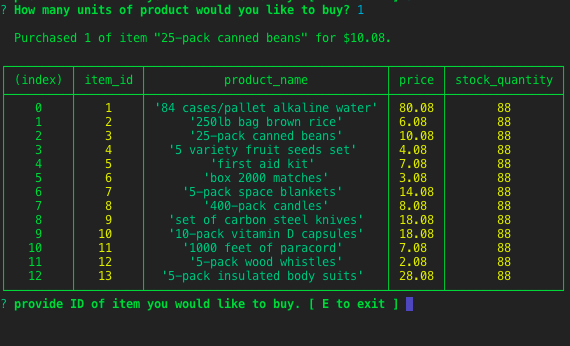

# CAMAZON
 Amazon-like storefront with MySQL and Node

CAMAZON is a wholesale survival store-front
<!-- img shows that database connects -->
 

 <!-- img shows that app exits when "E" is pressed -->
 

 <!-- img shows that app ask for item id and ask how many units wanted -->
 

